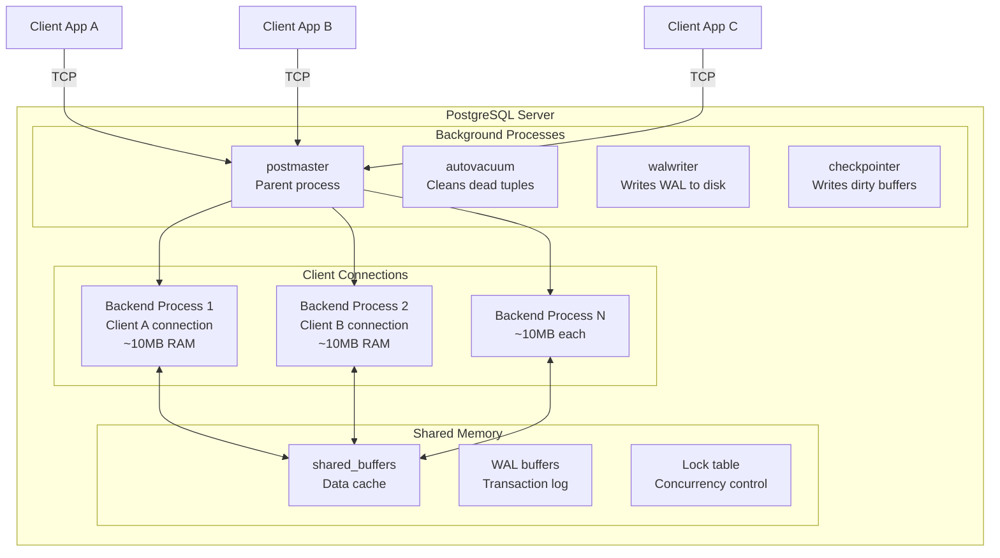

# PostgreSQL Process Model & MVCC

## Learning Objectives

Understand how PostgreSQL handles connections and concurrency at the process level.

## Why This Matters

| Concept | Production Impact |
|---------|-------------------|
| **Process-per-connection model** | Each connection uses ~10MB memory. 1000 connections = ~10GB RAM! |
| **MVCC** | Enables readers to never block writers. But creates dead tuples requiring vacuum. |
| **Transaction isolation** | Affects data consistency vs. concurrency trade-off. |
| **Connection pooling** | Essential for scaling to thousands of concurrent users. |

## Real World Use

### Verified Real-World Cases

**1. OpenAI - Scaling ChatGPT on PostgreSQL ([InfoQ](https://www.infoq.com/news/2026/02/openai-runs-chatgpt-postgres/))**
   - Single primary PostgreSQL handling millions of requests
   - Uses **PgBouncer in transaction-pooling mode** to manage connection limits
   - Reduced latency from **50ms to under 5ms** through connection pooling
   - Prevents connection spikes and reduces setup latency

**2. GitLab - Database Deletion Incident (2017) ([Official Postmortem](https://about.gitlab.com/blog/postmortem-of-database-outage-of-january-31/))**
   - Engineer accidentally removed production data during routine maintenance
   - **300GB of data lost**, 6 hours of production data permanently lost
   - ~18 hours of downtime
   - Root cause: Human error + inadequate backup/recovery safeguards
   - Led to industry-wide changes in DB operational practices

**3. Instagram - PostgreSQL Sharding to 300M+ Users ([Instagram Engineering](https://instagram-engineering.com/instagration-pt-2-scaling-our-infrastructure-to-multiple-data-centers-5745cbad7834))**
   - Scaled from small startup to **300M users by 2014**, **1B by 2018**
   - Kept PostgreSQL instead of moving to NoSQL
   - Implemented manual sharding across multiple PostgreSQL instances
   - Used Redis for shard mapping/routing
   - 400M daily photo uploads handled by 2012

## Architecture Overview



## Scenario

You're a DBA investigating a production issue:
- Application reports "too many connections" errors
- Database server shows high memory usage
- Some queries appear "stuck"

Your tasks:
1. Understand PostgreSQL's process model
2. See how MVCC enables concurrent access
3. Learn what each background process does
4. Practice connection management strategies

## Prerequisites

```bash
# Start the lab environment
cd postgres-deep-dive/learning-materials/01-architecture/01-process-model-and-mvcc/lab
docker-compose up -d

# Verify Postgres is running
docker exec postgres-arch psql -U postgres -c "SELECT version();"
```

## Your Tasks

### Task 1: Explore the Process Model

Connect to the running Postgres and investigate:
- How many processes are running?
- Which one is the postmaster?
- Which ones are backend processes?
- How much memory does each use?

### Task 2: Understand MVCC in Action

Create a scenario where:
- One transaction starts and reads data
- Another transaction modifies the same data
- First transaction still sees old data (snapshot isolation)
- Demonstrate non-blocking reads

### Task 3: Background Process Investigation

Identify and explain:
- What is autovacuum doing?
- What is the wal writer doing?
- What is the checkpointer doing?
- When would each become important?

### Task 4: Connection Limits

Test what happens when you exceed connection limits:
- Default `max_connections` is 100
- What happens at connection 101?
- How does connection pooling help?

## Getting Started

```bash
# 1. Start the environment
cd lab
docker-compose up -d

# 2. Connect to Postgres
docker exec -it postgres-arch psql -U postgres

# 3. Check the step files if you need hints
```

## Verification

```bash
# Run verification queries
docker exec postgres-arch psql -U postgres -f lab/verify.sql
```

## Expected Outcomes

After completing this lab, you should be able to:
1. Explain PostgreSQL's process-per-connection model
2. Describe how MVCC enables non-blocking reads
3. Identify all background processes and their roles
4. Understand when connection pooling is necessary
5. Recognize the memory implications of many connections
