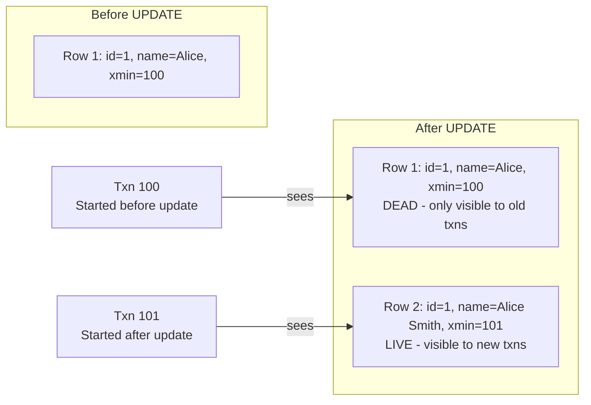

# Step 2: MVCC in Action

## Understanding Multi-Version Concurrency Control

MVCC is PostgreSQL's secret sauce. It allows **readers to never block writers, and writers to never block readers**.

### How MVCC Works

When you UPDATE a row:
1. Postgres **doesn't overwrite** the old row
2. Instead, it **inserts a new version** of the row
3. The old version is marked as "dead" but kept around
4. Each transaction sees a **snapshot** of data based on when it started



### Key Fields: xmin and xmax

Every row has hidden system columns:
- `xmin` = Transaction ID that **created** this row
- `xmax` = Transaction ID that **expired** this row (NULL for live rows)
- `ctid` = Physical location of the row (page number, offset)

---

## Your Investigation

### Setup: Create a Test Table

```sql
-- Connect to postgres
docker exec -it postgres-arch psql -U postgres

-- Create a simple table
CREATE TABLE mvcc_demo (
    id SERIAL PRIMARY KEY,
    name TEXT,
    balance DECIMAL(10,2)
);

-- Insert some data
INSERT INTO mvcc_demo (name, balance) VALUES
    ('Alice', 1000.00),
    ('Bob', 500.00),
    ('Charlie', 250.00);

-- Check the hidden columns
SELECT id, name, xmin, xmax, ctid
FROM mvcc_demo;

-- Notice: xmin has a value, xmax is NULL (row is live)
```

### Experiment 1: Non-Blocking Reads

**Terminal 1 (Transaction A)**:
```sql
BEGIN;

-- Check your transaction ID
SELECT txid_current();

-- Read the data
SELECT id, name, balance FROM mvcc_demo WHERE id = 1;
-- You should see: Alice, 1000.00

-- DO NOT COMMIT yet!
-- This transaction is now "open"
```

**Terminal 2 (Transaction B)** - Open a new connection:
```sql
-- While Transaction A is still open
BEGIN;

-- Update Alice's balance
UPDATE mvcc_demo SET balance = 1500.00 WHERE id = 1;

-- Check the result
SELECT id, name, balance FROM mvcc_demo WHERE id = 1;
-- You see: Alice, 1500.00

COMMIT;
```

**Back to Terminal 1 (Transaction A)**:
```sql
-- You're still in the same transaction
SELECT id, name, balance FROM mvcc_demo WHERE id = 1;

-- What do you see? Alice with 1000.00 or 1500.00?
-- You see: 1000.00 - your snapshot hasn't changed!

COMMIT;
```

**Key Insight**: Transaction A saw the OLD value even after Transaction B committed. This is **snapshot isolation**.

### Experiment 2: See the Dead Tuple

```sql
-- Check for dead tuples (requires superuser)
SELECT * FROM pg_stat_user_tables WHERE relname = 'mvcc_demo';

-- Look at: n_dead_tup
-- After the UPDATE, you should have 1 dead tuple

-- Force a vacuum to clean it up
VACUUM mvcc_demo;

-- Check again
SELECT * FROM pg_stat_user_tables WHERE relname = 'mvcc_demo';
-- n_dead_tup should now be 0
```

### Experiment 3: Row Versions with ctid

```sql
-- Create a scenario with multiple updates
INSERT INTO mvcc_demo (name, balance) VALUES ('Dave', 100.00);

-- Check initial state
SELECT id, name, ctid, xmin FROM mvcc_demo WHERE name = 'Dave';
-- Note the ctid: something like (0, 15)

-- Update it
UPDATE mvcc_demo SET balance = 200.00 WHERE name = 'Dave';

-- Check again
SELECT id, name, ctid, xmin FROM mvcc_demo WHERE name = 'Dave';
-- ctid changed! The row MOVED to a new location

-- What happened to the old ctid?
-- It's still there but marked as dead
-- We can see it with a page inspection (advanced)
```

### Experiment 4: Demonstrating bloat

```sql
-- Create a table with wide rows
CREATE TABLE bloat_demo (
    id SERIAL PRIMARY KEY,
    data TEXT
);

-- Insert wide rows
INSERT INTO bloat_demo (data)
SELECT repeat('x', 1000) FROM generate_series(1, 1000);

-- Check table size
SELECT pg_size_pretty(pg_total_relation_size('bloat_demo'));

-- Update every row (creates dead tuples)
UPDATE bloat_demo SET data = data || 'y';

-- Check size again
SELECT pg_size_pretty(pg_total_relation_size('bloat_demo'));
-- Size should have roughly DOUBLED!

-- Vacuum to reclaim space (but file won't shrink)
VACUUM bloat_demo;

-- Check size
SELECT pg_size_pretty(pg_total_relation_size('bloat_demo'));
-- Still large! Space is reusable but not returned to OS

-- VACUUM FULL rewrites the table (requires exclusive lock)
VACUUM FULL bloat_demo;

-- Check size
SELECT pg_size_pretty(pg_total_relation_size('bloat_demo'));
-- Now it's smaller!
```

---

## Think About It

1. **Why does UPDATE create a new row instead of modifying in place?**
   - MVCC requires old versions to exist for concurrent transactions
   - In-place updates would block or be invisible to other transactions

2. **What are the downsides of MVCC?**
   - Bloat: Dead tuples take up space until vacuum
   - Performance: More I/O to scan dead tuples
   - Complexity: Need vacuum, autovacuum

3. **Why doesn't VACUUM shrink the file?**
   - VACUUM marks dead tuples as reusable but doesn't rewrite
   - VACUUM FULL rewrites but locks the table
   - Trade-off: Online maintenance vs. space reclamation

---

## Mini-Challenge

Without looking it up: What happens if you have a long-running transaction that stays open for hours while other transactions are updating data?

**Try it**:
```sql
-- Terminal 1
BEGIN;
SELECT * FROM mvcc_demo;  -- Takes a snapshot
-- Leave this open for 2 minutes...

-- Terminal 2 - Run repeatedly
UPDATE mvcc_demo SET balance = balance + 1 WHERE id = 1;
-- Do this 10 times

-- Check dead tuples
SELECT n_dead_tup FROM pg_stat_user_tables WHERE relname = 'mvcc_demo';
```

What happens to `n_dead_tup`? Why can't vacuum clean them up?

<hr>

**Answer**:


Vacuum cannot remove dead tuples that are **newer than the oldest open transaction**.
The long-running transaction holds an old snapshot "hostage".
All dead tuples created after that transaction started must be kept!
This is why long-running transactions are dangerous in Postgres.
