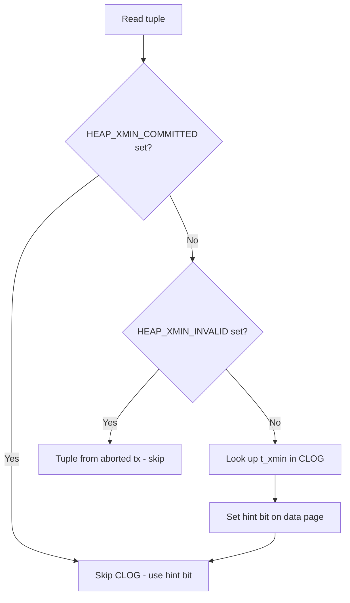

# Step 1: Hint Bit Fundamentals

## Understanding What Hint Bits Are

Every tuple (row) in PostgreSQL has a **23-byte header** stored on the data page alongside the row data. This header contains critical fields:

| Field | Size | Purpose |
|-------|------|---------|
| `t_xmin` | 4 bytes | Transaction ID that inserted this tuple |
| `t_xmax` | 4 bytes | Transaction ID that deleted/updated this tuple (0 if live) |
| `t_cid` | 4 bytes | Command ID within the inserting transaction |
| `t_ctid` | 6 bytes | Pointer to current version of this tuple (page, offset) |
| `t_infomask` | 2 bytes | Bitmask with flags about the tuple's state |
| `t_infomask2` | 2 bytes | Additional flags (number of columns, etc.) |

The **hint bits** live inside `t_infomask`. They are individual bits that cache the answer to: "Did transaction X commit or abort?"

### The Four Hint Bits That Matter

| Bit | Name | Decimal | What it means |
|-----|------|---------|---------------|
| 8 | `HEAP_XMIN_COMMITTED` | 256 | The inserting transaction (`t_xmin`) committed |
| 9 | `HEAP_XMIN_INVALID` | 512 | The inserting transaction (`t_xmin`) aborted |
| 10 | `HEAP_XMAX_COMMITTED` | 1024 | The deleting transaction (`t_xmax`) committed |
| 11 | `HEAP_XMAX_INVALID` | 2048 | No delete happened, or the deleting transaction aborted |

If neither `HEAP_XMIN_COMMITTED` nor `HEAP_XMIN_INVALID` is set, PostgreSQL doesn't know the status of `t_xmin`. It must look it up.

### Where does it look it up? The CLOG

The **Commit Log (CLOG)**, stored in `pg_xact/` files inside the data directory, is the authoritative source of transaction status. Every transaction that has ever committed or aborted has an entry here. The CLOG stores one of four states per transaction:

| State | Meaning |
|-------|---------|
| `0x00` | In progress |
| `0x01` | Committed |
| `0x02` | Aborted |
| `0x03` | Sub-committed |

### The Visibility Check Flow



**Without hint bits**: Every visibility check = CLOG lookup = potential random I/O to `pg_xact` files
**With hint bits**: Check a bit on the data page = no extra I/O at all

The hint bit is essentially a **cache of the CLOG answer, embedded directly in the tuple header**.

### Who Sets Hint Bits?

Hint bits are set by:

1. **First reader after commit** — When a SELECT encounters a tuple without hint bits, it looks up `t_xmin` in CLOG, discovers "committed", and sets `HEAP_XMIN_COMMITTED`. This dirties the page.
2. **VACUUM / Autovacuum** — As a side effect of scanning pages, VACUUM sets hint bits for all tuples it encounters. This is one of autovacuum's most important hidden benefits.
3. **Any DML that reads the page** — UPDATE, DELETE, and even some index operations can trigger hint bit setting.

**Hint bits are NOT set by the committing transaction itself.** The COMMIT only writes to WAL and CLOG. The data pages are not touched during commit. This is a deliberate design choice — committing is kept fast, and the cost of setting hint bits is deferred to the first reader.

---

## Your Investigation

### 1. See the Tuple Header Directly

```bash
docker exec -it pg-hint-bits psql -U postgres
```

```sql
-- pageinspect lets us read raw page contents
SELECT
    lp AS tuple_offset,
    t_xmin,
    t_xmax,
    t_infomask,
    CASE WHEN t_infomask & 256 = 256 THEN 'SET' ELSE 'NOT SET' END AS xmin_committed,
    CASE WHEN t_infomask & 512 = 512 THEN 'SET' ELSE 'NOT SET' END AS xmin_invalid,
    CASE WHEN t_infomask & 2048 = 2048 THEN 'SET' ELSE 'NOT SET' END AS xmax_invalid
FROM heap_page_items(get_raw_page('orders', 0))
LIMIT 10;
```

**What to look for**:
- `t_xmin` shows the transaction ID that inserted each row
- If `xmin_committed = 'SET'`, the hint bit is present — no CLOG lookup needed
- If `xmin_committed = 'NOT SET'`, Postgres would need to check CLOG to determine visibility

### 2. Observe Hint Bits Before and After First Read

```sql
-- Create a fresh table (no one has read these tuples yet)
CREATE TABLE fresh_rows (id serial PRIMARY KEY, val text);

-- Insert in an explicit transaction
BEGIN;
INSERT INTO fresh_rows (val) VALUES ('hello');
COMMIT;

-- Check hint bits BEFORE reading
SELECT
    t_xmin,
    CASE WHEN t_infomask & 256 = 256 THEN 'YES' ELSE 'NO' END AS xmin_committed_hint
FROM heap_page_items(get_raw_page('fresh_rows', 0))
WHERE t_xmin IS NOT NULL;

-- Now read the row
SELECT * FROM fresh_rows;

-- Check hint bits AFTER reading
SELECT
    t_xmin,
    CASE WHEN t_infomask & 256 = 256 THEN 'YES' ELSE 'NO' END AS xmin_committed_hint
FROM heap_page_items(get_raw_page('fresh_rows', 0))
WHERE t_xmin IS NOT NULL;
```

**Expected**: Before reading, `xmin_committed_hint = 'NO'`. After reading, `xmin_committed_hint = 'YES'`.

### 3. Check CLOG File Activity

```sql
-- The CLOG is stored in pg_xact directory
-- We can check transaction status programmatically:

-- Get current transaction ID
SELECT txid_current();

-- Check the status of a specific transaction
-- (You'll need to substitute the t_xmin value from the previous query)
SELECT pg_xact_status(t_xmin::text::bigint) AS tx_status
FROM heap_page_items(get_raw_page('fresh_rows', 0))
WHERE t_xmin IS NOT NULL
LIMIT 1;
```

### 4. See How VACUUM Sets Hint Bits

```sql
-- Create rows without hint bits
CREATE TABLE vacuum_hints (id serial PRIMARY KEY, data text);
INSERT INTO vacuum_hints (data) SELECT 'row-' || i FROM generate_series(1, 100) AS i;

-- Check: some hint bits may already be set (autovacuum or the INSERT's own reads)
SELECT
    count(*) AS total,
    count(*) FILTER (WHERE t_infomask & 256 = 0) AS missing_hint_bits
FROM heap_page_items(get_raw_page('vacuum_hints', 0))
WHERE t_xmin IS NOT NULL;

-- Run VACUUM (this sets hint bits as a side effect)
VACUUM vacuum_hints;

-- Check again
SELECT
    count(*) AS total,
    count(*) FILTER (WHERE t_infomask & 256 = 0) AS missing_hint_bits
FROM heap_page_items(get_raw_page('vacuum_hints', 0))
WHERE t_xmin IS NOT NULL;

-- Expected: missing_hint_bits should be 0 (or very close) after VACUUM
```

---

## Think About It

1. **Why doesn't the committing transaction set hint bits itself?**
   - COMMIT must be fast. Touching every data page touched by the transaction would be expensive. Deferring this to the first reader distributes the cost.

2. **What happens if hint bits are never set?**
   - Nothing breaks. Every visibility check falls back to CLOG. It's just slower — potentially much slower if CLOG pages aren't in shared_buffers.

3. **Why are hint bits stored in the tuple header instead of a separate structure?**
   - Locality. The hint bit is on the same page as the tuple. No extra I/O to check it. A separate structure would require its own I/O.

4. **What's the architectural tradeoff?**
   - Hint bits dirty data pages (write amplification) but eliminate CLOG lookups (read optimization). PostgreSQL chose read performance at the cost of slightly more writes.

---

## Mini-Challenge

**Predict then verify**: If you INSERT 1000 rows in a single transaction and then check hint bits on page 0, will they be SET or NOT SET?

```sql
CREATE TABLE challenge_1 (id serial PRIMARY KEY, data text);
BEGIN;
INSERT INTO challenge_1 (data) SELECT 'x' FROM generate_series(1, 1000);
COMMIT;

SELECT
    count(*) AS total,
    count(*) FILTER (WHERE t_infomask & 256 = 256) AS hint_bits_set,
    count(*) FILTER (WHERE t_infomask & 256 = 0) AS hint_bits_missing
FROM heap_page_items(get_raw_page('challenge_1', 0))
WHERE t_xmin IS NOT NULL;
```

What do you see? Why?

<hr>

**Answer**:


Hint bits are likely **NOT SET**. The COMMIT doesn't touch data pages. No SELECT has read these tuples yet, and autovacuum hasn't scanned them. Every tuple on this page still requires a CLOG lookup for visibility. Now run `SELECT count(*) FROM challenge_1;` and re-check — hint bits should be SET.
