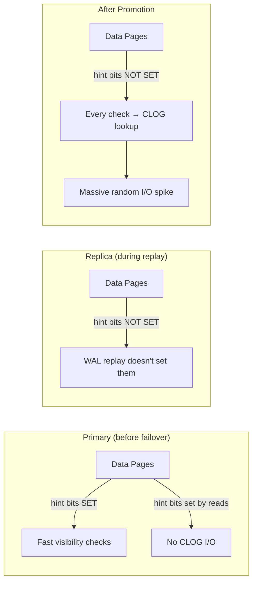

# Step 2: Hint Bit Storms & Failover

## Understanding the Failover Problem

### The Scenario

You have a primary-replica setup. The primary handles all writes and most reads. The replica exists for high availability — it applies WAL records but receives no direct read traffic.

```
[Application] → [Primary (reads + writes)] → WAL → [Replica (replay only, no reads)]
```

When you fail over to the replica:

1. The replica promotes itself to primary
2. The application starts sending queries to it
3. Every query that touches data pages must check tuple visibility
4. Since no one ever read these tuples on the replica, **no hint bits are set**
5. Every visibility check requires a CLOG lookup
6. CLOG lookups generate random I/O against `pg_xact/` files
7. **I/O spikes to 10-50x normal levels**

This is called a **hint bit storm**.

### Why the Storm Happens



The fundamental issue: **WAL replay does not set hint bits**. Hint bits are a local performance optimization on each server. They are not WAL-logged (by default), so they are not replicated.

### How Long Does the Storm Last?

It depends on:
- **Table size**: More pages = more tuples without hint bits = more CLOG lookups
- **Shared buffers**: If CLOG pages are in cache, lookups are fast. If not, random disk I/O.
- **Query patterns**: Full table scans are worst case. Index scans touching few rows may be fine.
- **Autovacuum activity**: Autovacuum sets hint bits as it scans pages. Once it processes a table, the storm for that table is over.

Typical duration: **30 seconds to 5 minutes** for most workloads. Can be longer for very large tables or slow storage.

---

## Your Investigation

### 1. Simulate a Hint Bit Storm

```sql
-- Connect
docker exec -it pg-hint-bits psql -U postgres

-- Create a table that simulates a replica's state:
-- lots of data, no reads, no hint bits
CREATE TABLE storm_simulation (
    id serial PRIMARY KEY,
    payload text,
    created_at timestamptz default now()
);

-- Insert data in many small transactions (each gets its own xmin)
DO $$
BEGIN
    FOR i IN 1..500 LOOP
        INSERT INTO storm_simulation (payload)
        VALUES (repeat('payload-' || i || '-', 20));
        COMMIT;
    END LOOP;
END $$;

-- Record baseline I/O stats
SELECT
    relname,
    heap_blks_read,
    heap_blks_hit,
    CASE WHEN heap_blks_read + heap_blks_hit > 0
        THEN round(heap_blks_hit::numeric / (heap_blks_read + heap_blks_hit) * 100, 2)
        ELSE 0
    END AS cache_hit_pct
FROM pg_statio_user_tables
WHERE relname = 'storm_simulation';

-- Check hint bit status on first page
SELECT
    t_xmin,
    t_infomask,
    CASE WHEN t_infomask & 256 = 256 THEN 'SET' ELSE 'MISSING' END AS xmin_hint
FROM heap_page_items(get_raw_page('storm_simulation', 0))
WHERE t_xmin IS NOT NULL
LIMIT 10;
```

**Expected**: Most `xmin_hint` values are `MISSING`.

### 2. Measure the Storm Impact

```sql
-- Time a full table scan (triggers hint bit setting for every tuple)
EXPLAIN (ANALYZE, BUFFERS, TIMING)
SELECT count(*) FROM storm_simulation;

-- Note the "Buffers:" line — look for:
-- shared read=N  (pages read from disk, including CLOG pages)
-- shared dirtied=N  (pages dirtied by setting hint bits)

-- Check I/O stats after
SELECT
    relname,
    heap_blks_read,
    heap_blks_hit,
    CASE WHEN heap_blks_read + heap_blks_hit > 0
        THEN round(heap_blks_hit::numeric / (heap_blks_read + heap_blks_hit) * 100, 2)
        ELSE 0
    END AS cache_hit_pct
FROM pg_statio_user_tables
WHERE relname = 'storm_simulation';

-- Now run the same scan again (hint bits are now set)
EXPLAIN (ANALYZE, BUFFERS, TIMING)
SELECT count(*) FROM storm_simulation;

-- The second scan should be faster with fewer shared read blocks
```

### 3. Prevention: Read Traffic on Replicas

The most effective prevention is routing some read traffic to replicas. Even lightweight reads set hint bits:

```sql
-- Simulate a pre-warm read on the replica (before failover)
CREATE TABLE prewarmed_table (
    id serial PRIMARY KEY,
    data text
);

INSERT INTO prewarmed_table (data)
SELECT 'data-' || i FROM generate_series(1, 10000) AS i;

-- Pre-warm: read the entire table to set hint bits
SELECT count(*) FROM prewarmed_table;

-- Verify: all hint bits should be set
SELECT
    count(*) AS total_tuples,
    count(*) FILTER (WHERE t_infomask & 256 = 256) AS hints_set,
    round(100.0 * count(*) FILTER (WHERE t_infomask & 256 = 256) / count(*), 1) AS pct_set
FROM heap_page_items(get_raw_page('prewarmed_table', 0))
WHERE t_xmin IS NOT NULL;

-- Expected: close to 100% hint bits set
```

### 4. The `wal_log_hints` GUC

```sql
-- Check if wal_log_hints is enabled
SHOW wal_log_hints;

-- This should return 'on' in our lab (set in docker-compose.yml)
```

**What `wal_log_hints` does**:
- When `on`, hint bit changes are logged to WAL
- This means replicas receive hint bits via WAL replay
- **Trade-off**: Increases WAL volume by ~10-20%
- **Critical for**: `pg_rewind` — without it, you can't rewind a former primary to become a replica after failover

**Why it doesn't fully solve hint bit storms**:
- Even with `wal_log_hints = on`, hint bits set on the primary are replicated
- But hint bits are only set when tuples are *read* on the primary
- If the primary's hint bits were set long ago, they're already in WAL
- The real issue is tuples that were never read on *either* server

### 5. Monitoring for Hint Bit Storms

```sql
-- Watch for I/O spikes in pg_stat_database
SELECT
    datname,
    blks_read,
    blks_hit,
    CASE WHEN blks_read + blks_hit > 0
        THEN round(blks_hit::numeric / (blks_read + blks_hit) * 100, 2)
        ELSE 0
    END AS cache_hit_ratio
FROM pg_stat_database
WHERE datname = current_database();

-- Per-table I/O (look for tables with high blks_read)
SELECT
    relname,
    heap_blks_read,
    heap_blks_hit,
    CASE WHEN heap_blks_read + heap_blks_hit > 0
        THEN round(heap_blks_hit::numeric / (heap_blks_read + heap_blks_hit) * 100, 2)
        ELSE 0
    END AS cache_hit_pct
FROM pg_statio_user_tables
ORDER BY heap_blks_read DESC;

-- Check for tables that haven't been vacuumed recently
-- (vacuum sets hint bits)
SELECT
    relname,
    n_live_tup,
    n_dead_tup,
    last_vacuum,
    last_autovacuum,
    vacuum_count,
    autovacuum_count
FROM pg_stat_user_tables
ORDER BY n_live_tup DESC;
```

---

## Think About It

1. **Why isn't `wal_log_hints` the default?**
   - Extra WAL volume (~10-20%) is a cost. For many workloads, it's unnecessary because autovacuum and read traffic set hint bits naturally. Only enable it when you need `pg_rewind` or have failover concerns.

2. **What if you can't send reads to the replica?**
   - Run periodic `SELECT count(*) FROM table` as a maintenance job. This reads all pages and sets hint bits. Schedule it during off-peak hours.

3. **Why does autovacuum help with hint bits?**
   - Autovacuum scans pages to find dead tuples. As it scans, it sets hint bits on every tuple it encounters. This is a free side effect. Tables that are vacuumed regularly rarely have hint bit issues.

4. **What's the relationship between hint bits and the visibility map?**
   - The visibility map is a separate structure that marks pages as "all-visible" (all tuples are visible to all transactions). When a page is all-visible, index-only scans can skip heap fetches entirely. Hint bits are a prerequisite — VACUUM sets the visibility map bit only after confirming all tuples on the page are visible (which requires checking or setting hint bits).

---

## Mini-Challenge

**Scenario**: You're about to fail over from primary to replica. The replica has been running but only replaying WAL — no read traffic. You have a 50GB `orders` table with 100M rows.

Write a pre-failover warmup script:

```sql
-- Pre-failover: warm up the most important tables
-- This sets hint bits so the storm doesn't happen after promotion

-- Warm up the orders table (most queried)
SELECT count(*) FROM orders;

-- Warm up the products table
SELECT count(*) FROM products;

-- Warm up the audit_log table
SELECT count(*) FROM audit_log;

-- Verify hint bits are set
SELECT
    relname,
    pg_size_pretty(pg_relation_size(relname::text)) AS size,
    last_autovacuum,
    autovacuum_count
FROM pg_stat_user_tables
WHERE relname IN ('orders', 'products', 'audit_log')
ORDER BY pg_relation_size(relname::text) DESC;
```

How long would this take on a 50GB table? What would you do if you can't afford a full table scan?

<hr>

**Answer**:


A `SELECT count(*)` on a 50GB table takes roughly 10-30 seconds depending on hardware. For time-sensitive failovers, scan only the hottest tables. Alternative: run `VACUUM` on each table — it scans pages and sets hint bits, and you can do it table-by-table without blocking. For very large tables, consider `VACUUM` with `vacuum_cost_limit` set high to finish faster.
