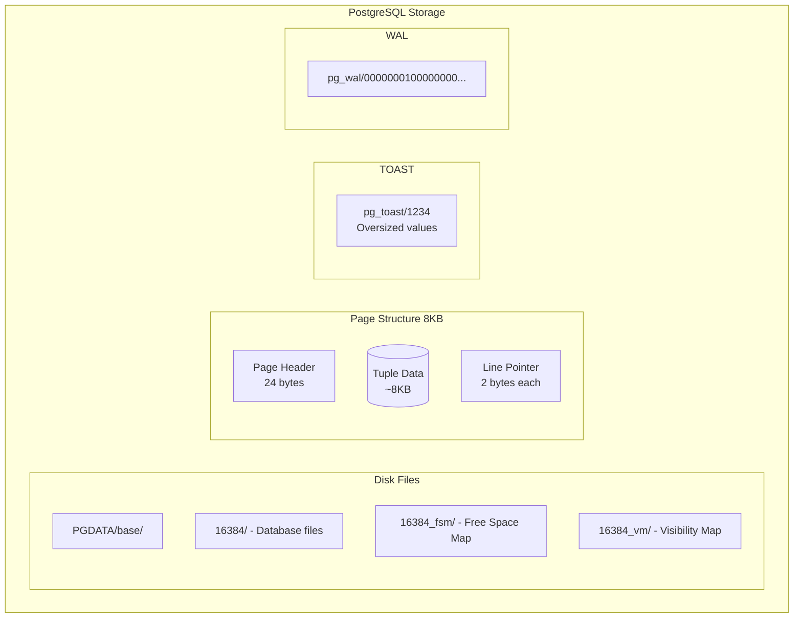

# Pages, TOAST & WAL

## Learning Objectives

Understand how PostgreSQL physically stores data on disk.

## Why This Matters

| Concept | Production Impact |
|---------|-------------------|
| **8KB Pages** | Large rows span pages, affecting I/O |
| **TOAST** | JSONB/text columns stored separately. Understanding TOAST helps query planning. |
| **WAL** | Write-Ahead Log enables crash recovery and replication. |
| **Checkpoints** | Frequent checkpoints = more I/O but faster crash recovery. |

## Real World Use

### When This Matters

1. **Large JSONB columns causing slow queries**
   - Table with `metadata JSONB` column averaging 50KB per row
   - Query `SELECT id, metadata FROM users WHERE id = ?` takes 50ms
   - Problem: Each heap fetch reads entire 50KB TOAST chunk
   - Solution: Use INCLUDE index or select only needed columns

2. **Storage bloat after mass updates**
   - `UPDATE products SET status = 'processed'` for 1M rows
   - Table size doubles: dead tuples not cleaned up
   - Investigation: `n_dead_tup > n_live_tup` in `pg_stat_user_tables`
   - Solution: Tune autovacuum or run manual VACUUM

3. **WAL disk filling up**
   - High write traffic: 10K writes/sec
   - WAL grows at 1GB/min, filling disk
   - Checkpoint interval too long, wal_buffers too small
   - Solution: Adjust `checkpoint_timeout`, `max_wal_size`

4. **Page splits causing fragmentation**
   - Table with `fillfactor=100` (default)
   - Updates cause row to grow, needs new page
   - Result: Table has 50% empty space but no room for updates
   - Solution: Lower fillfactor for frequently updated tables

## Architecture Overview



## Scenario

You're investigating:
1. Why queries on a table with large JSONB columns are slow
2. What happens when a row exceeds 8KB
3. How WAL affects write performance
4. Understanding disk layout for backup planning

## Your Tasks

### Task 1: Explore Page Structure

Examine how rows are stored within 8KB pages.

### Task 2: Understand TOAST

Create rows larger than 8KB and see how Postgres handles them.

### Task 3: WAL Impact on Performance

Measure write performance with different WAL settings.

### Task 4: Checkpoint Behavior

Observe how checkpoints affect I/O and recovery time.

## Getting Started

```bash
cd postgres-deep-dive/learning-materials/02-storage/01-pages-toast-wal/lab
docker-compose up -d
```

## Verification

```bash
docker exec postgres-storage psql -U postgres -f lab/verify.sql
```
