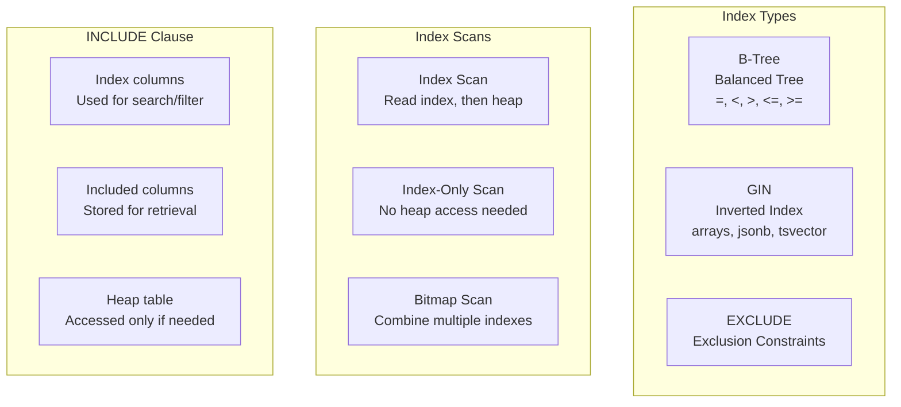

# B-Tree, GIN & INCLUDE Indexes

## Learning Objectives

Master PostgreSQL indexing strategies for real-world query performance.

## Why This Matters

| Index Type | Use Case | Production Impact |
|------------|----------|-------------------|
| **B-Tree** | Equality, range queries | Default index. First tool for optimization. |
| **GIN** | Arrays, JSONB, full-text search | Essential for jsonb containment queries. |
| **INCLUDE** | Covering indexes | Eliminates heap fetches. Major speedup. |
| **Partial** | Filtered indexes | Smaller, faster for specific queries. |

## Real World Use

### When This Matters

1. **Dashboard query slow despite index**
   - Query: `SELECT customer_id, order_date, total FROM orders WHERE customer_id = ? ORDER BY order_date DESC LIMIT 20`
   - Has index on `customer_id` but still slow
   - EXPLAIN shows: `Index Scan` with high `Buffers: shared read`
   - Problem: Must fetch each row from heap to get `total`, `order_date`
   - Solution: `CREATE INDEX idx_orders_customer_inc ON orders(customer_id) INCLUDE (order_date, total)`

2. **JSONB array queries slow**
   - Query: `SELECT * FROM events WHERE tags @> ARRAY['urgent', 'vip']`
   - Full table scan, 500ms response time
   - Problem: No index on JSONB column
   - Solution: `CREATE INDEX idx_events_tags_gin ON events USING GIN (tags)`

3. **Too many indexes slowing writes**
   - Table has 15 indexes for "every possible query"
   - INSERT takes 500ms due to index maintenance
   - Result: Write throughput drops to 200/sec
   - Solution: Remove unused indexes, use partial indexes for hot queries

4. **Index bloat after bulk delete**
   - Deleted old data but table size same
   - Index still contains deleted entries
   - Solution: `REINDEX CONCURRENTLY index_name` (zero downtime)

## Architecture Overview



## Scenario

You're optimizing a real e-commerce database:
- Products table with JSONB attributes
- Orders table with date range queries
- Search queries by multiple columns
- Dashboard queries slow due to heap fetches

## Your Tasks

### Task 1: B-Tree Internals

Understand how B-Tree indexes work and when they're used.

### Task 2: INCLUDE for Index-Only Scans

Eliminate heap fetches using INCLUDE.

### Task 3: GIN for JSONB

Optimize JSONB containment queries with GIN.

### Task 4: Partial and Expression Indexes

Create specialized indexes for specific query patterns.

## Getting Started

```bash
cd postgres-deep-dive/learning-materials/03-indexing/01-btree-gin-include-indexes/lab
docker-compose up -d
```

## Verification

```bash
docker exec postgres-index psql -U postgres -f lab/verify.sql
```

## Expected Outcomes

After this lab, you will:
1. Understand when the planner chooses index vs. sequential scan
2. Create covering indexes with INCLUDE
3. Use GIN for JSONB/array queries
4. Recognize index bloat and when to reindex
