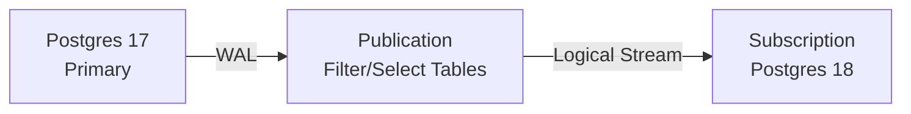

# Step 2: Creating Publications

## What is a Publication?

A **publication** defines which data changes are broadcast for replication.



### Create Publication

```sql
-- On Postgres 17
docker exec -it pg-upgrade-17 psql -U postgres appdb

-- Publish ALL current and future tables
CREATE PUBLICATION upgrade_pub FOR ALL TABLES;

-- Verify
SELECT * FROM pg_publication;
```

### Publication Options

```sql
-- Publish only specific tables
CREATE PUBLICATION selective_pub
FOR TABLE users, orders, products;

-- Publish with row filtering (Postgres 15+)
CREATE PUBLICATION filtered_pub
FOR TABLE orders
WHERE (status = 'active');

-- Publish with partition changes
CREATE PUBLICATION partition_pub
FOR TABLE my_partitioned_table;
```

### Check What's Published

```sql
-- List all publications
SELECT
    pubname,
    puballtables,
    pubinsert,
    pubupdate,
    pubdelete,
    pubtruncate
FROM pg_publication;

-- List tables in publication
SELECT
    pubname,
    schemaname,
    tablename
FROM pg_publication_tables;
```

### Make Changes Replicate

```sql
-- Test that changes are captured
BEGIN;
INSERT INTO products (name, price) VALUES ('New Product', 99.99);
COMMIT;

-- Check replication slot (created automatically)
SELECT
    slot_name,
    slot_type,
    active,
    restart_lsn,
    pg_size_pretty(pg_wal_lsn_diff(pg_current_wal_lsn(), restart_lsn)) AS lag_bytes
FROM pg_replication_slots
WHERE slot_type = 'logical';
```

---

## Mini-Challenge

**Predict**: If you add a new table AFTER creating the publication, is it replicated?

```sql
-- After CREATE PUBLICATION ... FOR ALL TABLES
CREATE TABLE new_table (id SERIAL, data TEXT);

-- Insert data
INSERT INTO new_table (data) VALUES ('test');

-- Is this replicated to Postgres 18?
```

<hr>

**Answer**:


**YES!** `FOR ALL TABLES` includes tables created in the future.
This is the key difference vs. `FOR TABLE t1, t2` which only includes specified tables.


**Try it**: Verify after setting up subscription in Step 3.
