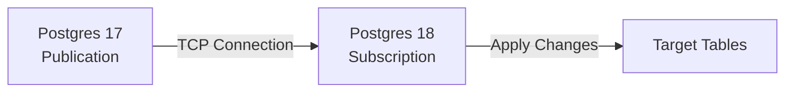

# Step 3: Creating Subscriptions

## What is a Subscription?

A **subscription** connects to a publication and pulls changes.



### Initialize Target Database

First, copy the schema (no data yet):

```bash
# From host
docker exec pg-upgrade-17 pg_dump -U postgres \
    --schema-only \
    --no-owner \
    --no-privileges \
    appdb | \
docker exec -i pg-upgrade-18 psql -U postgres -d appdb
```

**Why `--schema-only`?**
- Copy table structure, indexes, constraints
- Data will come via replication (with `copy_data = true`)

### Create Subscription

```sql
-- On Postgres 18
docker exec -it pg-upgrade-18 psql -U postgres appdb

CREATE SUBSCRIPTION upgrade_sub
CONNECTION 'host=pg-upgrade-17 port=5432 user=postgres dbname=appdb'
PUBLICATION upgrade_pub
WITH (
    copy_data = true,        -- Copy existing data
    create_slot = true       -- Create replication slot
);
```

### What Just Happened?

1. **Connection established** to pg-17
2. **Replication slot created** on pg-17
3. **Initial data copied** (like pg_dump restore)
4. **Logical replication started** for new changes

### Check Subscription Status

```sql
-- On Postgres 18
SELECT
    subname,
    subenabled,
    conninfo,
    slot_name,
    synccommit,
    skipped_lsn,
    CASE
        WHEN state = 'initializing' THEN 'Copying initial data'
        WHEN state = 'catchup' THEN 'Catching up to primary'
        WHEN state = 'streaming' THEN 'Fully caught up, applying changes'
        ELSE state
    END AS state
FROM pg_stat_subscription;
```

### Monitor Replication Lag

```sql
-- On Postgres 18
SELECT
    subname,
    EXTRACT(EPOCH FROM latest_end_time - last_msg_send_time)::int AS lag_seconds,
    EXTRACT(EPOCH FROM latest_end_time - last_msg_receipt_time)::int AS receipt_lag_seconds
FROM pg_stat_subscription;
```

**Target**: Lag < 1 second before cutover

### Check for Errors

```sql
-- Any replication errors?
SELECT * FROM pg_stat_subscription_error;

-- Common errors:
-- - "relation does not exist" → Schema mismatch
-- - "column does not exist" → Schema mismatch
-- - "permission denied" → User permissions
```

---

## Troubleshooting

### Issue: "subscription requires replication slot"

```sql
-- Check max_replication_slots
SHOW max_replication_slots;  -- Default: 10

-- If 0, enable it
ALTER SYSTEM SET max_replication_slots = 20;
-- Requires restart
```

### Issue: Tables missing on subscriber

```sql
-- This happens if tables on primary aren't on subscriber

-- Check publication tables
SELECT * FROM pg_publication_tables WHERE pubname = 'upgrade_pub';

-- Check subscriber tables
SELECT tablename FROM pg_tables WHERE schemaname = 'public';

-- Solution: Add missing tables to subscriber
-- Then: ALTER SUBSCRIPTION ... REFRESH PUBLICATION;
```

### Issue: Data type mismatch

```sql
-- Common with enums, domains
-- Solution: Ensure types exist on subscriber first
CREATE TYPE my_enum AS ENUM ('a', 'b', 'c');
```

---

## Mini-Challenge

**What happens if you add a new column on the primary after replication is running?**

```sql
-- On pg-17
ALTER TABLE products ADD COLUMN new_col TEXT;

-- Does this break replication?
-- Does the column appear on pg-18?
```

<hr>

**Answer**:


**It works!** Logical replication handles DDL (ADD COLUMN) automatically.
The column is added to pg-18.

**However**: `ALTER TABLE ... DROP COLUMN` requires special handling to avoid breaking replication.
